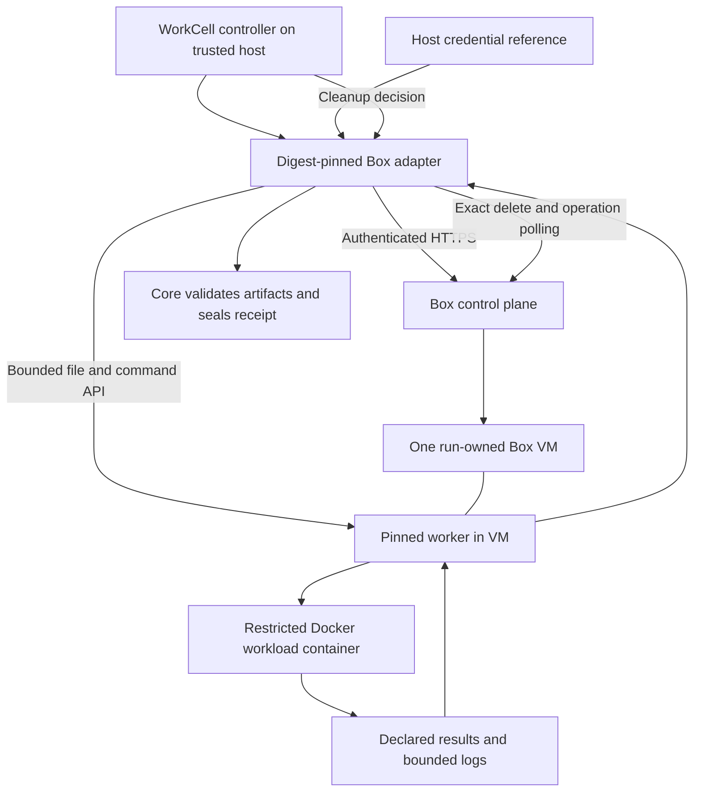

# WorkCell + Box by ASCII: research and architecture build plan

Research date: **2026-09-05**. Audience: WorkCell maintainers and the implementation agent. Status: **research complete; conditional build recommendation; no integration implemented and no live certification**.

WorkCell baseline: `074d7262ef6c565e3dabd22ee046228c7329e5c1`, product `1.1.0`, inspected directly in the local repository. Required Kujo: `1.2.1`, commit `692512a9070fdba713f160d795bbddb8077db7b5`. Box baseline: public API `/api/box/v1`, OpenAPI document version `1.0.0`; npm SDK `0.0.34`; Python SDK `0.0.35`. These identify the research inputs, not a tested deployment.

Scope is WorkCell → Box compute/transport → isolated workload → local evidence and exact cleanup. No account creation, credentials, provider resources, production changes, integration code, release publication, or earlier prototype were used. Primary documentation and published SDK types were fetched without authentication. The browser fetcher could read the product homepage but rejected the docs host; direct HTTPS retrieval of the Markdown documentation and OpenAPI succeeded. [Evidence ledger](evidence.md) and [retrieval hashes](source-index.json) preserve provenance. All architecture, profile fields, worker behavior, milestones, and new commands below are **proposals**, unless explicitly called current.

## Executive Summary

**Box is a plausible compute substrate, but is not presently a proven drop-in implementation of WorkCell’s full remote contract.** Build an external host-side adapter with a small, pinned worker in each Box. Run the workload in a constrained Docker container inside the Box VM. Keep WorkCell and the Box account API key on the controller host. Do not install a second WorkCell coordinator in every machine.

The worker is justified by current source: every portable definition requires an OCI image, exact CPU/memory/PID limits, argv semantics, and bounded execution; typical definitions also require network denial and read-only filesystems. A writable, sudo-capable Ubuntu VM plus a shell command does not implement those semantics. The existing protocol can express the worker-backed disposable path without a Box branch in core. [WorkCell requirements](../../../src/evidence/controls.kujo), [portable definition](../../../src/domain/portable_definition.kujo), [Box machine capabilities](https://docs.ascii.dev/box/machines).

Three issues must remain explicit:

1. **Unknown provisioning recovery is incomplete in Box’s documented API.** Create supports a 24-hour idempotency key, but neither create nor list/get exposes an atomic run-ID/nonce metadata binding. A later rename leaves a crash window. Local durable state helps after an ID is received; it cannot identify a resource whose first response was lost. Require provider confirmation or a supported ownership/lookup extension before claiming mandatory ownership conformance. [API](https://docs.ascii.dev/box/api/v1), [OpenAPI](https://docs.ascii.dev/openapi/box-v1.yaml).
2. **Remote failure preservation needs a small core lifecycle addition.** `cleanup.keep_failed` is parsed, but the remote coordinator never branches on it: failures and ordinary completion call `destroy_and_inventory`. An adapter cannot secretly reinterpret destroy as archive and return an empty inventory. The plan below isolates this provider-neutral change from the first disposable adapter milestone. [Coordinator](../../../src/execution/portable_coordinator.kujo).
3. **Deletion is asynchronous.** A deleted Box disappears from normal reads before its deletion operation completes. Empty listings alone cannot prove completed cleanup. Adapter inventory must retain pending deletion operations as owned resources; interrupted or lost deletion responses may still require provider help. WorkCell can preserve and verify evidence of provider-reported cleanup; it cannot prove physical erasure during an outage. [Deletion](https://docs.ascii.dev/box/data-retention).

Proceed with an offline candidate and contract tests. Do not promise official status, live security, full crash recovery, or production readiness until the blockers and live gates are satisfied. If Box cannot supply durable ownership recovery, keep the adapter experimental or decline it; do not weaken WorkCell’s mandatory contract to accommodate the provider.

## What WorkCell Currently Supports

### Versions, workload, and provider boundary

The stable claim is local/CI Docker and Podman on supported Linux/macOS hosts. Portable definitions `workcell-definition/v2alpha1`, protocol `workcell-backend/v1alpha1`, and receipts `workcell-receipt/v2alpha1` remain additive alpha. The current security review contains historical v1.0 wording; the current product is 1.1.0. No current documentation establishes live certification for the three official remote adapters. [README](../../../README.md), [compatibility](../../api-compatibility.md), [limitations](../../known-limitations.md).

| Area | Current source-backed behavior | Consequence for Box |
| --- | --- | --- |
| Workload format | Strict JSON v1 for OCI; v2 requires `linux-process`, an image reference, argv, `/workspace`, clean Git commit and portable clone. Provider fields excluded. | A Box snapshot is not the OCI image. Keep both identities. |
| Compute | v2 CPU integer 1–64, memory in m/g up to 64 GiB, PIDs 1–65,536; all become required exact semantic controls. | Machine size is capacity, not arbitrary workload limits. |
| Execution | Positive timeout ≤86,400,000 ms; output ≤16,000,000 bytes. Verification commands are additional execute attempts. | Reject unsupported duration/output combinations before create. |
| Profiles | `workcell-host-profiles/v1alpha1`: backend, credential reference, endpoint, region, provider project, adapter options, policy. | Put Box size, TTL, environment and snapshot selection in adapter options. |
| Profile policy | Exact adapter digest and preflight ceilings for CPU, memory, PIDs, execution time/output and upload/download. | These are deterministic bounds, not a dollar budget or provider quota reservation. |
| Protocol | Explicit local manifest/executable, one request per subprocess; bounded JSONL log events and exactly one result. Closed envelope and operation validation. | No CLI text scraping, auto-discovery or automatic adapter downloads. |
| Capability negotiation | Each mandatory/requested control gets a result; accepted values must equal requested values. Unknown/unsupported enforcement cannot be accepted. | No “close enough” VM memory or silent network fallback. |
| Identity | Handle carries backend/version/provider/profile fingerprint, `{kind,id}` resources, run ID and unpredictable nonce; bounded provider state excludes credentials/signed URLs. | IDs and redacted facts only; no raw Box response or desktop URL. |
| Credentials | Manifest-advertised `env:`, `kujo-agent:`, `os-store:` syntax; official adapters resolve only `env:`. Core sends PATH plus selected credential; execute also receives declared secret names via host process environment. | Explicit host-only `env:BOX_API_KEY`; task secrets must remain separate. |
| Workspace | One-commit shallow clone, remote removed, hooks/credential helper disabled; dirty source, submodules, LFS pointers and symlinks rejected. SHA-256 archive and per-file manifest; bounded file count, expanded bytes/depth. | Upload that package, never the ambient checkout/home directory. |
| Transfer integrity | Prepare must return independently observed archive digest; export is untrusted tar staged locally, checked for path/type/bounds, re-exported under artifact policy and rehashed. | Upload success and remote-provided artifact hashes are insufficient. |
| Artifacts | Only declared relative paths; byte/file/depth/extension limits and allow/reject/redact secret policy. | No whole-VM or whole-snapshot download as normal export. |
| Evidence | Local integrity manifest covers receipt and immutable evidence; portable logs are `log-events.json`, buffered protocol, separate streams. v1 has stdout/stderr and patch files; portable coordinator currently exposes changed-file evidence, not the same v1 patch/log layout. | Show real paths from the receipt; do not promise v1 filenames on remote runs. |
| Timing/cost | Core monotonic phase timings. Cost stays `unknown`/null without exact-run provider billing evidence. | Price calculations in this report are estimates, never receipt amounts. |
| Cleanup/recovery | Core writes intent before provision and attaches handle before prepare. Inventory before/after destroy; exact run+nonce, complete inventory required. Handle-less intents can recover from exact owned inventory. | Box must provide ownership evidence even when the machine is inaccessible. |
| Cancellation | `--cancel-file` terminates the execute adapter process; portable core destroys the resource using durable ownership. A workload is never retried automatically. | Keep cleanup independent of the command subprocess. Do not equate Box prompt interrupt with command-tree termination. |
| Preservation | v1 `--keep-failed` preserves local workspace, not running container. Remote path currently destroys regardless of parsed `keep_failed`. Optional pause/resume/snapshot/metrics names exist, but no integrated preservation/replay CLI. | Explicit core extension needed for the requested preserve-on-failure UX. |

Source anchors: [definition](../../../src/domain/portable_definition.kujo), [controls](../../../src/evidence/controls.kujo), [types](../../../src/backend/types.kujo), [client](../../../src/backend/client.kujo), [packager](../../../src/workspace/package.kujo), [archive acceptance](../../../src/artifacts/archive.kujo), [receipts](../../../src/receipts/v2.kujo), [recovery](../../../src/recovery/recovery.kujo).

Core protocol defaults include a 1 MiB line bound and 100,000-event ceiling; total process output is separately bounded. Encoding a full workload output budget into base64 JSONL consumes more bytes than the workload text. Box’s adapter must reserve room for the terminal result and emit small chunks; a first candidate should expose a conservatively smaller log retention envelope with truthful truncation, not assume the raw output limit also fits the protocol. [Client](../../../src/backend/client.kujo), [official log bounding](../../../adapters/official/runtime/providers.mjs).

### Built-ins and existing adapter precedents

Docker/Podman v2 routes through the existing stable OCI lifecycle. WorkCell applies structured engine argv, non-root/rootless identity, dropped capabilities, private IPC, no-new-privileges, read-only root, resource limits, explicit mounts/network and ownership-scoped removal. gVisor/Kata are OCI runtime selections. Domain allowlists are not converted into named Docker networks. [Security model](../../security-model.md), [backend guide](../../backend-adapters.md).

E2B pins `e2b@2.46.1` and uses metadata for run+nonce, file APIs and sandbox kill. Vercel pins `@vercel/sandbox@3.2.1`, uses tags, native command argv and network policy; arbitrary memory requires a reviewed exact operator guarantee. Daytona pins `@daytona/sdk@0.207.1`, uses labels, file/process APIs and delete; accepts endpoint/region, rejects provider-project. E2B/Vercel reject nonempty routing overrides they cannot implement. These are patterns to audit, not evidence that Box has equivalent labels, cancellation, or networking. [Provider implementations](../../../adapters/official/runtime/providers.mjs), [provider operations](../../provider-operations.md).

The official Node ≥20 package is `@kujolang/workcell-official-adapters@0.1.0`. Launchers, runtime, package metadata, lockfile and bundled dependency files form an integrity chain. Release candidates include archive/checksums, SBOM and unsigned provenance; install scripts disabled and installed tree read-only. Offline tests and clean-install checks precede exact account/plan/region/API/SDK live evidence and zero-owned-orphan reconciliation. [Distribution](../../official-adapter-distribution.md), [authoring](../../adapter-authoring.md), [live gate](../../live-provider-certification.md).

### What core owns versus the adapter/worker

Core owns workload semantics, validation, capability acceptance, source packaging, verification sequencing, artifact acceptance, receipts, failure categorization and the cleanup decision. The adapter owns Box authentication/API calls, resource mappings, bounded transport, provider normalization, owned-resource inventory and exact deletion. The worker owns the mechanical implementation of the resolved container plan, process supervision, remote archive verification and declared export construction. The operator owns the host, credential custody, approved worker/image digests, account/retention/egress policy and live acceptance. The provider owns VM isolation, placement, control plane and storage deletion. None of these authorities is interchangeable.

## What Box Currently Supports

### Compute, startup and access

Box documents x86_64 Linux VMs with Docker and broad development tooling. The current machine page calls CPUs **shared**, while the homepage calls VM time dedicated; do not infer dedicated physical CPU allocation. Current types are small/default/large/xlarge, although the homepage and npm 0.0.34 enum list only three. API types and resource values need live agreement. Capacity shortages may substitute available hardware, another reason to enforce workload limits in a container. [Machines](https://docs.ascii.dev/box/machines), [homepage](https://box.ascii.dev/), [published SDK](https://registry.npmjs.org/@asciidev/box-sdk/-/box-sdk-0.0.34.tgz).

Create returns provisioning identity; poll get until usable and then probe the worker. Box `ready` does not imply `setupScript` completed or all lazy-restored files hydrated. `setupStatus`/`setupError` and `box.hydrated` provide separate information. API `running`/`idle` describes provider prompt work, not arbitrary commands. [Create](https://docs.ascii.dev/box/api/reference/boxes/create-box), [API lifecycle](https://docs.ascii.dev/box/api/v1), [setup](https://docs.ascii.dev/box/setup).

Authentication is bearer account service key; key creation/rotation/revocation needs browser-session authority, not a service key. Per-Box keys have a narrower machine scope. General per-operation/project RBAC for service keys is not documented: “one key per project” is organization practice, not demonstrated resource scoping. Do not use account secrets or key-management APIs for discovery. [API keys](https://docs.ascii.dev/box/api-keys).

TypeScript `@asciidev/box-sdk@0.0.34` is generated, fetch-based, with no declared runtime dependencies in its published metadata; Python `ascii-box-sdk@0.0.35` requires Python ≥3.9 and urllib3/dateutil/pydantic/typing-extensions. Both cover lifecycle/files/commands/snapshots. npm types are more reliable for the pinned package than stale prose method tables, but neither constitutes runtime validation. See the exact discrepancy ledger in [evidence](evidence.md). [TypeScript](https://docs.ascii.dev/box/sdks/typescript), [Python](https://docs.ascii.dev/box/sdks/python), [PyPI metadata](https://pypi.org/pypi/ascii-box-sdk/json).

### Commands, files, SSH and events

| Feature | Documented surface | Important limit |
| --- | --- | --- |
| Synchronous command | `POST /boxes/{boxId}/commands`, SDK `command` | Shell string and cwd; timeout 1–600 seconds, default 30. Not native argv/env/stdin. |
| Detached command | Same request with `detached:true`; `GET .../commands/{processId}`, SDK `commandStatus` | Tail logs, `running`/`exited`/`lost`; `tailBytes` 1–524,288 per stream. Lost state is not proof of exit. |
| Command transport ambiguity | API documents `502 box_direct_failed` | Command may already be running; never blind-retry workload submission. |
| File upload/read | `PUT`/`GET .../files`, UTF-8/base64 | Canonical roots `/home/user` and `/tmp`; upload body/provider maximum not specified. |
| Artifact download | `GET .../artifacts?path=...` | Binary download, not WorkCell declaration validation. SDK Blob/file buffering must be bypassed or bounded. |
| SSH/SCP | Public key registration `POST .../sshkey`, user `user`, assigned machine IP | CLI uses persistent host key file; prefer an adapter-generated ephemeral key if added later. |
| Lifecycle/progress | Cursor-paginated events; optional webhooks | Events are not authoritative exit status for direct commands. |

Sources: [command endpoint](https://docs.ascii.dev/box/api/reference/agent/execute-box-command), [status endpoint](https://docs.ascii.dev/box/api/reference/agent/get-command-status), [SSH/files](https://docs.ascii.dev/box/ssh-access), [artifact endpoint](https://docs.ascii.dev/box/api/reference/agent/download-box-artifact).

Webhooks have four lifecycle events, account-wide scope, HMAC-SHA256 of delivery ID, timestamp and raw body, a five-minute verification-window example, delivery-ID deduplication, out-of-order at-least-once delivery, up to eight attempts and a five-second response timeout. Endpoint limit is ten, HTTPS/443/public addresses only; delivery history is dashboard-only with 30-day retained delivery records. Do not register webhooks for the initial adapter; polling needs no inbound host service. If later added, authenticate raw bytes before JSON parsing, constant-time compare, reject stale/future timestamps, deduplicate, and re-read resource state. [Webhooks](https://docs.ascii.dev/box/webhooks).

### Environments, networking and persistence

Box environments are named, versioned configuration containing repositories, variables, files and credential-forwarding toggles. `safeForThirdParties` and per-machine `noEnv:true` suppress owner-managed credentials; explicit per-Box env still applies. Converting snapshots scrubs specified managed credential files, but not arbitrary user-created `.npmrc`, cloud credentials or Docker logins. Forks/templates may inherit per-Box env unless explicitly replaced. Names select current environment versions; get reports the attached version. No create field pins an arbitrary historical version. [Environments](https://docs.ascii.dev/box/environments).

Dedicated IPv6 **or** IPv4 is documented, not guaranteed dual-stack, selectable family or stable IP across resume. Hosted HTTPS routes and desktop access exist; exposed service routes are normally token-gated, and in-VM sudo/firewall commands can open raw ports. No documented create-time egress allowlist, deny-all network, metadata restriction or private-network policy exists. The host needs HTTPS to the control plane; guest services need their provider connectivity. `noEnv` is not network denial. Region choice through create is also undocumented; data residency in Germany/Finland/France is a provider claim. [Hosting](https://docs.ascii.dev/box/hosting), [FAQ](https://docs.ascii.dev/box/faq), [OpenAPI](https://docs.ascii.dev/openapi/box-v1.yaml).

Snapshots capture filesystem changes, not process memory. Home, selected system modifications and Docker named volumes survive; manually started processes and machine identity do not. Enabled services restart; Docker build cache/unreferenced images do not automatically survive. Automatic snapshots are described as minutely plus on stop. Named snapshots are independent, mutable-name references to frozen content, at most ten, no expiry until removed. Resume keeps Box ID; fork/new-from-template creates a new ID. Stop/archive retains recoverable data; permanent deletion queues removal. ZDR prevents retention after archive and disallows named snapshot creation. [Snapshots](https://docs.ascii.dev/box/snapshots), [retention](https://docs.ascii.dev/box/data-retention).

## Compatibility and Gap Analysis

| Contract/control | Direct VM adapter | Recommended worker/container | Remaining proof or gap |
| --- | --- | --- | --- |
| `image.oci` | Box base/snapshot cannot satisfy arbitrary image | Run exact workload OCI image inside Box | Image digest, trusted registry/pull and cold-cache tests |
| CPU/memory/PID limits | Fixed machine classes not exact arbitrary limits | Docker cgroup limits, PID cap; leave host headroom | Observe cgroups; reject unavailable controllers; never round memory |
| Read-only root, tmpfs, writable paths | VM writable/sudo is incompatible | Container root read-only, explicit workspace/tmpfs | Worker config, mount and write-denial probes |
| `network.none` | `noEnv` provides different semantics | Container `--network none`; worker/control plane outside workload netns | Probe IPv4/IPv6/DNS/private/metadata from workload |
| Domain allowlist | No equivalent documented API | Not in first candidate | Reject; do not substitute hostname filtering or a proxy env var |
| Explicit environment/argv | Shell string and inherited machine environment | Worker accepts structured argv/env, launches without shell interpolation | Tests for quoting, controls, ambient env, missing secrets |
| Bounded output/cancel | API tails/buffering and prompt interrupt insufficient | Worker supervisors drain/discard beyond cap and stop process tree/container | Host transport caps; detached semantics and disconnect probes |
| Ownership/crash inventory | No atomic metadata or idempotency lookup shown | Host ledger + isolated worker marker helps known IDs | **Provider gap for lost first response; no complete ownership claim** |
| Cleanup | DELETE accepted and list absence not completion | Persistent deletion-operation entries in adapter inventory | Lost DELETE response with unknown operation; API outage remains unknown |
| Failure preservation | Box supports stop/fork; core always destroys | Small core preservation policy + optional snapshot operation | Requires versioned semantics and recovery tests |
| Snapshot/environment provenance | Names mutable; version selection limited | Read expected IDs/version, verify worker recipe/content and record observed values | Read-before/read-after cannot prove race-free server pinning |
| Exact money/region | No exact-run invoice or create region selector established | Record unknowns and provider observations separately | Ask Box; reject unsupported requested placement |

The first release should support only `small`, `default`, `large`; reject `xlarge` until the pinned SDK and live account support it. Its initially certifiable security profile should be network-none workloads in the nested container. Public-network workloads need a separately reviewed profile and cannot inherit the network-none claim.

## Architecture Options

| Option | Changes and compatibility | Dependencies/security | Maintenance, lock-in, tests and UX | Core change? |
| --- | --- | --- | --- | --- |
| A. Built-in Box | New provider API/transport paths in Kujo core, same unresolved ownership limits | Box API logic enters every install; mixes provider lifecycle with core | Highest regression surface; provider drift tied to core releases; all OCI/core tests plus Box tests; simpler initial install only | Large and unjustified |
| B. External, direct VM | Standard executable adapter; direct commands cannot satisfy arbitrary OCI/resource semantics | SDK remains external, but workload can reach VM tools/sudo | Smaller code but semantic mismatch; tests would have to reject normal strict workloads; profile UX clean only for a different workload contract | Avoid redefining the contract to make it fit |
| C. WorkCell inside each Box | Host still must provision, transfer and delete; inner WorkCell generates nested receipts and cleans only its containers/workspaces | Pin Kujo+WorkCell everywhere; never give inner copy Box key | Two coordinators, duplicate evidence/recovery, snapshot version coupling; test both lifecycles; confusing which receipt is authoritative | Host-side adapter still needed; not a replacement |
| D. Host WorkCell + small worker | External adapter sends a resolved bounded execution plan; worker implements Docker policy and transport mechanics | Node SDK on host; pinned worker + Docker in VM; Box key host-only | Moderate, contained maintenance; VM gives outer boundary; standard WorkCell CLI/profile; test protocol, worker controls, live VM and cleanup | None for supported disposable runs; small generic addition for preservation |
| E. External adapter, shell/Docker scripts only | Similar to D but implement supervision/limits through generated shell snippets | Fewer runtime files but quoting/process-tree and transfer risks | Becomes a worker implicitly as soon as bounds/recovery are correct; fragile status/log parsing | None initially, same preservation gap |

Choose D delivered as B’s external package. This decision is based on the mandatory controls in source, not a preference for adding infrastructure. Do not create a daemon fleet, scheduler, plugin platform or generalized remote execution framework.

## Recommended Architecture



The worker is a command-line helper, not an orchestration service. Use Python standard library for subprocess, bounded pipe readers, archive handling and digest checks; verify the installed Python version. Host adapter stays JavaScript ESM with SDK TypeScript declarations checked during development, matching the existing official runtime. The worker has no Box SDK/key and exposes no public network listener. It only executes an adapter-generated bounded request placed in a root-owned control directory. The workload gets a separate non-root UID, only its workspace mount, no Docker socket, no host home/control files, no host network, no privileged mode and no sudo path into the VM.

Start transport with HTTPS APIs: bounded base64 upload into `/tmp`, fixed worker launch command, detached status polling, bounded binary artifact download via SDK `artifactRaw().raw.body` or a narrowly reviewed equivalent streaming fetch. Do not call a buffering Blob convenience method for arbitrarily sized exports. Read-only APIs also need response-size caps before JSON parsing. Bind the authenticated fetch implementation to the exact control-plane origin; reject cross-origin redirects rather than forwarding Authorization to a returned URL. Chunk uploads conservatively (proposed 192 KiB raw chunks), independently hash concatenated bytes, and reject unsupported provider body limits rather than silently truncating.

The worker’s remote workspace lives at `/home/user/workcell-runs/<run-id>/workspace` but is mounted at `/workspace` inside the container. Persist it under a captured path so failure snapshots can contain it; control requests, task secrets and ephemeral transport files live outside that mount, preferably tmpfs. Never change the portable `/workspace` contract because Box file APIs restrict roots.

Resolve is offline/static for `describe` and the deterministic fixture path. Live preflight may read limits/retention and selected snapshot metadata only under explicit operator use; it cannot create or edit environments. Separate static acceptance from observed post-create checks. Box’s normal environment-list response includes contents: do not log or persist it, and avoid reading it unnecessarily. `noEnv:true` remains mandatory regardless of selected named environment.

### Ownership and deletion ledger

Use an absolute operator-owned `state_dir`, mode 0700; immutable per-run records mode 0600, atomic rename+fsync, symlink refusal and per-run locking. Scope by account identity, profile fingerprint, run ID and nonce. It stores canonical request hash/idempotency key/timestamps, stable Box IDs, worker/container IDs, returned snapshot IDs, deletion-operation IDs and last reconciliation status, never API keys, task secret values or signed URLs. This is adapter transport/recovery state, not a second workload coordinator.

Before create, persist the exact request and key intent. After a successful response, fsync ID→ownership before returning a handle or doing prepare. Post-create name/worker markers are secondary diagnostics; names are never ownership authority. Passing run ID and nonce in create-time `env` does not close the gap: list/get does not return those fields, guest reads require a reachable machine, and guest-controlled marker content is not immutable provider ownership evidence. Do not inspect arbitrary unrelated machines looking for a matching file and treat that alone as authorization. Inventory joins provider IDs/states against this trusted mapping and returns honest adapter-attributed ownership. If an unresolved create intent could have produced an unmapped machine, inventory is `complete:false`, even when the provider list is empty. Do not assign a newly discovered ID just because its time/name resembles this run.

The normal core cleanup rebuilds a handle from inventory and discards the earlier `provider_state`. Therefore deletion-operation identity **must** survive in adapter state and appear in inventory, not only inside the original handle. Represent a pending operation as `{kind:"box-deletion",id:"bdop_…",ownership:…}`; destroy on it polls rather than issues a new deletion. Treat `blocked`/deadline exhaustion as remaining resources. Only after provider `completed` and complete reconciliation may the adapter remove the pending entry. Preserve terminal tombstones to make repeated recovery deterministic.

Current receipt projection does not copy `provision.actual_resolution` wholesale, and cleanup replaces the original handle state. Put bounded observed Box/environment/snapshot identity in the initial `handle.provider_state` before returning provision; it is persisted in the recovery journal, which the receipt points to and the final manifest hashes. Return later worker/image observations as explicit bounded entries in `collect.attempt_inventory`, which core copies into receipt resources, with their observation authority identified. Do not put those facts in `metrics` merely to make them persist: core labels nonempty metrics provider-reported. Core currently does not project `workspace_delta.complete` into the receipt, so the Box adapter must fail collection on an incomplete delta instead of reporting a successful partial collection. No new core field is needed for the disposable evidence path, but these projection rules need coordinator-level fixture tests.

A lost initial create response can be retried by **provision** with the same key/body inside a bounded window; this is a safe create retry according to Box, but not a read-only inventory operation. Never POST create from inventory: when no prior creation occurred it would create a new billable machine. Past the 24-hour retention, never reuse the key hoping to find an old machine. A lost delete response similarly requires a durable operation lookup by target, or must remain unknown if the Box is already hidden. These are provider-confirmation blockers, not reasons to guess ownership or claim deletion completed.

### Smallest justified core extension

No Box-specific provider branch belongs in core. To support **full requested failure preservation**, reuse the already-recognized optional `snapshot` operation as the preservation action with a defined provider-neutral versioned payload/result; do not redefine destroy. Its request should carry handle, expected ownership, idempotency key and a disposition describing stopped filesystem preservation. Its result should carry the owned preserved handle/resources, snapshot identity, stopped-state evidence, retention deadline and limitations. Existing optional payload/result validation is too loose to define these semantics safely. Add a capability such as `lifecycle.preserve_failure` and negotiate it **only when requested**.

Keep v1 and existing alpha1 behavior supported. Define a parallel `workcell-backend/v1alpha2` preservation contract and `workcell-receipt/v2alpha2` for the changed preservation/evidence semantics; retain alpha1 for disposable adapters. Portable definition `cleanup.keep_failed` already exists: version-aware coordinator selection can reject unsupported remote preservation rather than silently destroy. Wire the CLI `--keep-failed` flag into this generic selection. Do not mutate the old strict wire contract in place. Add generic lifecycle CLI operations only for preserved records, as specified below, without backend-name branching.

Before preserving, core decides from execution, verification, export and interruption outcomes, not merely the first command’s exit code. Persist preservation intent before the adapter call. On success record run failure separately from `cleanup.status:"preserved"`, retained resources and expiry. Recovery skips preserved resources unless the operator explicitly selects them. On preservation failure default to recorded cleanup failure and recovery-required; a profile may explicitly choose delete fallback before the run. Do not silently force archive or throw away failed evidence.

Task secrets require an additional boundary check: core currently grants them only to execute, so export/collect cannot rely on reading them from ambient environment. The worker must redact logs while executing and scrub task secret material before preservation. Reject preservation for runs with task secrets in the first implementation. Allowing it later requires a separately reviewed snapshot-secret policy; transformed secrets cannot be proven absent.

## WorkCell-to-Box Lifecycle Mapping

All routes below are relative to `https://ascii.dev/api/box/v1`. “Worker” denotes the proposed pinned helper, not a Box API feature. Method names were checked against npm 0.0.34 declarations and public OpenAPI. [API specification](https://docs.ascii.dev/openapi/box-v1.yaml), [SDK reference](https://docs.ascii.dev/box/sdks/typescript).

| WorkCell operation | Box API / SDK and worker operation | Required inputs | Returned identity / evidence | Retry and failure behavior | Cleanup behavior |
| --- | --- | --- | --- | --- | --- |
| `describe` | No network; static adapter metadata | None, no credential | Adapter/build, contracts, profile schema, references, hints | Deterministic; reject unsupported protocol | None |
| `resolve` | Local mapping; explicitly gated read-only preflight may use limits/retention/named snapshot get | Requirements + workload intent, normalized profile | Exact control ledger, resolved plan, provider identity, volatile fields, unknown cost | Reject missing mandatory ownership/worker guarantees; no optimistic provisioning | No resources created |
| `provision` | `POST /boxes`, `create`; optional replay source uses `POST /boxes/{id}/fork`, `fork`; then `get` | Run+nonce, canonical key/body, small/default/large, short TTL, `noEnv:true`, explicit env replacement, optional `from`/environment | Durable Box ID, requested/observed type, environment/version, source snapshot assertion, archiveAfter, owned handle | Same-key/body retry bounded below 24h; 409 in-progress backoff; mismatch permanent; lost result unresolved; readiness not setup completion | Intent before call, ID fsync before return; failure stays recoverable |
| `prepare` | `writeFile` chunks under `/tmp`; fixed worker verify/extract command; container preparation | Package archive/hash/manifest, handle, resolved plan, worker digest | Independent archive hash, per-file checks, workspace root `/workspace`, observed image/worker/config | Same digest idempotent, mismatch fails; replacement upload cannot overwrite another run | Remove chunks/staging; preserve handle if preparation fails |
| `execute` | `command({detached:true})` starts worker attempt; `commandStatus` polls; worker launches container argv/env | Attempt ID, argv, `/workspace`, explicit nonsecret env, host-only task secret channel, timeout/output caps | Box process ID + unique worker attempt/container ID; normalized exit/signal/timeout/cancel and log bounds | Atomic attempt claim prevents duplicate execution; never retry uncertain raw command; `lost` is unknown absent worker terminal evidence | Worker kills owned process tree on deadline; core may destroy VM |
| `collect` | Worker status and bounded Git status `-z`; read/download only controlled evidence | Handle, attempt ID/cursor | Authoritative attempt terminal, per-stream completeness, workspace delta, worker observations, attempt inventory | Parse bounded NUL-safe output; malformed/truncated delta not `complete:true`; unknown metrics remain unknown | Temporary evidence files removed with run/VM |
| `export` | Worker builds declared-only tar; `artifactRaw` streamed to requested host staging directory | Declarations, limits, exporter version, owned destination, idempotency key | Local archive path/size/hash, declared list, item failures and temporary-resource list | Reject traversal/types/symlinks/races/oversize; stream cap before extraction; core independently validates/re-exports/hashes | Remove untrusted staging even on verification failure; do not download snapshot wholesale |
| `cancel` | Worker cancels exact attempt/container; fallback permanent delete VM; do not rely on prompt `interrupt` | Handle + command/attempt identity + expected ownership | Requested/confirmed/already-terminal/unknown and certainty | Termination confirmed only by worker/container evidence or provider completed deletion; outage unknown | Current core cancel-file path terminates adapter then destroys VM; generic preservation policy must handle interrupted runs explicitly |
| `inventory` | Complete cursor iteration of `GET /boxes` plus owned ledger/deletion-operation reads; snapshots as required | Exact ownership tuple and configured account scope | All owned live/archived machines and pending deletion/snapshot resources; completeness flag | Read-only; cap pages/time and fail incomplete rather than drop remainder; unmapped creation/hidden deletion uncertainty persists | No deletion; unrelated resources ignored, never adopted by name |
| `destroy` | `DELETE /boxes/{id}` / `deleteBox`, exact `X-Ascii-Confirm-Delete`; `getDeletionOperation`; optional exact owned snapshot delete | Inventory-derived exact IDs, expected ownership, durable ledger | Itemized removed/pending/blocked/error; operation ID and final provider status | Repeated calls reconcile same intent; 404 alone insufficient without prior terminal evidence; respect dependency 409 | Success requires no unexpected owned remnants, no pending operations; reusable input snapshots are never owned cleanup targets |
| `record` | **Core-local**, not an adapter protocol operation | Normalized results, controls, artifacts, cleanup evidence | Receipt, manifest, recovery journal and pointers | Atomic writes; missing receipt or failed manifest never success | Preserve recovery state even if recording fails |

Non-execute operations currently have a 120,000 ms core timeout. Adapter internal operation/polling budgets must end earlier and persist intermediate state. Named snapshot save may take minutes and physical deletion may outlast this window: return remaining/unknown and let explicit recovery continue; never hold the coordinator indefinitely or misreport completion. [Coordinator timeout](../../../src/execution/portable_coordinator.kujo).

| Optional operation | Mapping and decision |
| --- | --- |
| Pause | Box stop is filesystem checkpoint + archive, not process-memory pause. Keep portable process pause unsupported; expose stopped preservation under explicitly defined semantics. |
| Resume | Box resume reuses ID on new hardware, restarts enabled services and loses process memory. For human investigation only at first; do not silently resume a completed WorkCell attempt. |
| Snapshot | Automatic snapshots are provider-managed. Named save is `saveNamedSnapshot`, poll name until ready/failed; asynchronous, mutable alias, explicit owned-resource tracking. |
| Preserve | Generic core optional snapshot/disposition workflow: stop, verify archived + completed fresh snapshot, record retained identity/expiry. ZDR or task secrets rejects preflight. |
| Fork/replay | New WorkCell run+nonce and idempotency key; Box fork source retained. Replay is a new attempt from captured filesystem, not deterministic continuation. Need new capability/CLI semantics when using the failed workspace rather than a fresh Git package. |
| Metrics | Worker may observe CPU/memory/process timings; Box has type/multiplier and account limits. Keep provider billing and placement unknown unless exactly attributable. |

### Outcome classification

| Situation | Run result and evidence | Resource disposition |
| --- | --- | --- |
| Successful disposable | Terminal exit 0, verification/artifacts pass, completed provider deletion, complete inventory | Destroy; only local evidence remains |
| Failed disposable | Nonzero exit retained as workload failure, not transport error | Collect/export if safe, then destroy; cleanup failure separately visible |
| Failed preserved | Workload/verification failure + explicit preserved status, stopped snapshot identity/expiry | Retain only owned machine/snapshot; never report zero resources |
| Interrupted | Cancel marker/signal, uncertain or confirmed termination stated | Default destroy; only explicit pre-run preserve policy can change it after extension |
| Unknown provision | Intent exists, no trustworthy ID mapping | `recovery-required`; same-key provision retry where safe, never new-key automatic rerun |
| Orphaned Box | Exact run+nonce binding found, no active controller, not intentionally preserved | Recover by exact handle/inventory; otherwise report unclassified resource, no automatic deletion |
| Partial cleanup | Machine gone but deletion pending/blocked, or some owned resources remain | Keep operation identities and retryable journal; exit cleanup failure |
| TTL expired | `archiveAfter` passed plus observed archive/expiry evidence; time passage alone insufficient | Archived snapshot may remain; disposable runs still require permanent delete |
| Provider/API outage | No fresh authoritative inventory/terminal state | Unknown, no cleanup proof; TTL is a cost backstop, not erasure evidence |

## Proposed Configuration and Schemas

### Workload stays provider-neutral

This example uses **current v2alpha1 fields**. It is a design example, not an installed Box integration. An implementation must replace the image tag with a verified immutable digest for certification. Its shell command is intentionally part of workload argv; the host adapter does not concatenate it into a shell program.

```json
{
  "schema": "workcell-definition/v2alpha1",
  "name": "box-portable-smoke",
  "workload": {
    "kind": "linux-process",
    "image": {"reference": "alpine:3.20", "digest": "", "signature_key": ""},
    "command": ["sh", "-c", "printf 'ok\\n' > result.txt"],
    "working_directory": "/workspace"
  },
  "workspace": {
    "source": "clean-git-commit", "materialization": "portable-clone", "mount_path": "/workspace",
    "scan": {"max_files": 1000, "max_bytes": 10485760, "max_depth": 32}
  },
  "environment": {"allow": [], "set": {"CI": "1"}},
  "secrets": [],
  "requirements": {
    "compute": {"cpus": 1, "memory": "512m", "pids": 64},
    "execution": {"timeout_ms": 30000, "max_output_bytes": 1048576},
    "network": {"mode": "none"},
    "filesystem": {"read_only_root": true, "writable": ["/workspace"], "tmpfs": ["/tmp"]}
  },
  "artifacts": {
    "export": ["result.txt"], "max_bytes": 1048576, "max_files": 10, "max_depth": 8,
    "allowed_extensions": [".txt"], "secret_action": "reject"
  },
  "verification": {"version": 1, "commands": [{"name": "result", "command": ["test", "-s", "result.txt"]}]},
  "cleanup": {"keep_failed": false},
  "receipt": {"path": ".workcell/runs"}
}
```

### Host profile

Outer shape is current; `adapter_options.box` is the **proposed** `workcell-box-profile/v1alpha1` configuration. Placeholder digests/IDs deliberately prevent accidental use. A profile template is not an operator attestation.

```json
{
  "schema": "workcell-host-profiles/v1alpha1",
  "profiles": {
    "box-small": {
      "backend": "box",
      "credential_ref": "env:BOX_API_KEY",
      "adapter_options": {
        "box": {
          "schema": "workcell-box-profile/v1alpha1",
          "type": "small",
          "ttl_seconds": 300,
          "no_env": true,
          "environment": "workcell-safe-20260905",
          "expected_environment_version": 1,
          "snapshot": {
            "name": "kujo-agent-core-20260905-v1",
            "expected_snapshot_id": "REPLACE_WITH_REVIEWED_SNAPSHOT_ID",
            "recipe_sha256": "REPLACE_WITH_REVIEWED_RECIPE_SHA256"
          },
          "worker": {"version": "0.1.0", "sha256": "REPLACE_WITH_REVIEWED_WORKER_SHA256"},
          "state_dir": "/var/lib/workcell/box",
          "transport": "https",
          "ownership_mode": "provider-confirmed",
          "request_timeout_ms": 15000,
          "operation_timeout_ms": 110000,
          "log_retention_bytes": 262144,
          "max_concurrent_runs": 1,
          "operator_attestation": "REPLACE_WITH_REVIEWED_PROFILE_DIGEST"
        }
      },
      "policy": {
        "max_cpus": 1, "max_memory_mb": 512, "max_pids": 64,
        "max_timeout_ms": 30000, "max_output_bytes": 1048576,
        "max_workspace_upload_bytes": 10485760,
        "max_artifact_download_bytes": 10485760
      }
    }
  }
}
```

`ownership_mode:"provider-confirmed"` is a **release gate**, not an API flag and not currently substantiated. The resolver must reject until a reviewed implementation supplies the needed provider contract/evidence. No “assume ownership” switch. Add `policy.required_adapter_digest` to generated installations with the actual 64-hex SHA-256 launcher digest, never a placeholder in an approved profile.

Profile validation specification:

| Field | Validation and semantics |
| --- | --- |
| `type` | Enum small/default/large; workload caps independently enforced, with operator-reviewed capacity headroom. |
| `ttl_seconds` | Positive integer; API range 1–2,592,000 seconds; initial adapter narrows to 60–3600 seconds, default 300. Reject null/infinite. Must cover startup, preparation, every execute/verification, collection/export and cleanup margin. |
| `no_env` | Required literal true on create/fork/resume; explicit `env:{}` or bounded nonsecret adapter control values to replace inherited per-Box values. |
| `environment` | Optional bounded name; missing explicit environment permits only verified no-env semantics, never owner-default credentials. |
| `expected_environment_version` | Positive integer; compare observed attachment before prepare. noEnv may report null environment/version: record null and reject an exact named-version requirement rather than fabricate the match. |
| `snapshot` | Optional object; lowercase/digit/hyphen name ≤63 chars, expected opaque snapshot ID, recipe digest; no unknown fields. Absence uses stock VM and explicit worker bootstrap. |
| `worker` | Exact semantic version + SHA-256; bootstrap verifies pinned bytes, no remote installer/download execution. |
| `state_dir` | Absolute approved path, owner-only, no symlinks, durable locking; required even across subprocess invocations. No credential files searched. |
| `transport` | `https` only initially; SSH is a separate explicit future mode. |
| Timeouts | Request 1–15,000 ms, operation ≤110,000 ms to leave core deadline margin; bounded retries count within deadline. |
| `log_retention_bytes` | Initial ≤262,144 total raw bytes per execute; never exceeds requested max; truncation explicit. Reserve JSON/base64/result overhead within protocol output cap; reject budgets too small for framing. |
| `max_concurrent_runs` | Local-host lock/semaphore ceiling, not a provider account-wide guarantee across independent hosts. |
| Attestation | Reviewed worker/profile digest reference; resolve derives exact operator-claimed values from the approved worker plan and rejects missing/unapproved attestations. No catch-all `guarantees` acceptance. |
| Optional `org` | Explicit billing wallet only; implement and test body/header precedence. Empty means personal. Reject nonempty generic `provider_project`/`region` until accurately mapped. |
| Endpoint | Default fixed ASCII HTTPS origin; reject arbitrary/custom endpoint in live mode, even if generic WorkCell profile parser accepts HTTPS. Fake transport selected by isolated test entrypoint. |

Fix numeric ambiguity in implementation: `ttl_seconds` is seconds, core timeouts are milliseconds, API resource memory is labeled GB, and Docker memory values are binary units. Convert explicitly and record source units; do not infer API “4 GB” equals a workload limit of `4g`.

### Manifest proposal

This uses the **current manifest field names**, with an intentionally invalid digest placeholder. Disposable compatibility uses alpha1; alpha2 is added only when preservation is implemented and negotiated. Adapter release version is independent of SDK version.

```json
{
  "schema_version": "workcell-backend-manifest/v1",
  "id": "box",
  "adapter_version": "0.1.0",
  "contract_versions": ["workcell-backend/v1alpha1"],
  "executable": "workcell-backend-box",
  "profile_schema": "workcell-box-profile/v1alpha1",
  "credential_refs": ["env:BOX_API_KEY"],
  "static_capability_hints": ["lifecycle.provision", "workspace.stage", "artifact.selective_export"],
  "platforms": ["darwin", "linux"],
  "minimum_workcell_version": "1.1.0",
  "digest": "sha256:REPLACE_WITH_GENERATED_LAUNCHER_DIGEST"
}
```

### CLI experience

Current WorkCell CLI syntax, usable **after installing the proposed adapter** and replacing profile placeholders:

```bash
./bin/workcell validate --file examples/box/workcell.json
./bin/workcell inspect --file examples/box/workcell.json \
  --profiles /approved/workcell/host-profiles.json --profile box-small \
  --manifest adapters/official/box/manifest.json --summary
./bin/workcell run --file examples/box/workcell.json --repo /path/to/clean/repository \
  --profiles /approved/workcell/host-profiles.json --profile box-small \
  --manifest adapters/official/box/manifest.json --summary
./bin/workcell verify --run /path/to/clean/repository/.workcell/runs/RUN_ID --json
```

Select a different named snapshot/environment/size/TTL by another profile, e.g. `--profile box-browser` with snapshot `browser-20260905-v1`, environment `workcell-safe-20260905`, type `default`, TTL 900. The workload does not gain Box-specific image fields. `inspect` must fail before create if the provider-specific profile cannot meet the workload.

For ordinary current recovery, use the exact generated normalized adapter-options file, **not the outer host-profiles document**:

```bash
./bin/workcell recover --journal /evidence/RUN_ID/recovery/RUN_ID.json \
  --manifest adapters/official/box/manifest.json \
  --profile /approved/workcell/box-resolved-options.json --dry-run --json
# After checking exact account, run ID, nonce and completeness:
./bin/workcell recover --journal /evidence/RUN_ID/recovery/RUN_ID.json \
  --manifest adapters/official/box/manifest.json \
  --profile /approved/workcell/box-resolved-options.json --json
```

Inspect receipt-selected artifact/log paths with `jq` or the file viewer after `verify`; do not print raw provider payloads or retrieve secret-bearing desktop URLs.

The following are **proposed generic CLI additions/behavior**, not commands supported today. Implement them in the preservation milestone, with help/schema/tests, only for adapters advertising the new optional capability:

```bash
# Existing flag, newly wired to portable preserved-resource semantics:
workcell run --file workcell.json --repo . --profiles host-profiles.json \
  --profile box-investigate --manifest adapters/official/box/manifest.json --keep-failed --summary
# New read-only provider inventory, including unknowns and intentional retention:
workcell inventory --profiles host-profiles.json --profile box-investigate \
  --manifest adapters/official/box/manifest.json --json
# New explicit investigation resume (not replay of the old attempt):
workcell resume --preservation /evidence/RUN_ID/preservation.json \
  --manifest adapters/official/box/manifest.json --profiles host-profiles.json --profile box-investigate
# New correlated run from a captured failed workspace, leaving parent untouched:
workcell replay --preservation /evidence/RUN_ID/preservation.json --fork \
  --file replay-workcell.json --manifest adapters/official/box/manifest.json \
  --profiles host-profiles.json --profile box-investigate --summary
# Explicit cleanup of retained resources; reuse recovery rather than broad clean:
workcell recover --journal /evidence/RUN_ID/recovery/RUN_ID.json \
  --manifest adapters/official/box/manifest.json --profile box-resolved-options.json \
  --include-preserved --dry-run --json
# Repeat the same command without --dry-run to execute the reviewed cleanup.
```

A replay using the failed filesystem must not pretend its input is an unchanged clean Git package. Define a new optional provider-neutral source materialization in a future definition revision, with preservation manifest/digest and parent-run linkage, before enabling that CLI. Until then, a new run may use a clean source commit and reusable runtime snapshot; it is a rerun, not failed-workspace replay. Keep interactive Box investigation in an adapter-owned utility if maintainers decline a broader generic CLI; do not falsely document `workcell resume` as existing.

## Secret and Network Security Model

The exact secret boundary is: **Box service key enters only the host adapter’s explicit API authentication path. Task secrets, if used, may enter only the workload’s intentional execution channel.** No Box service key in worker request, guest environment, archive, snapshot, logs, receipt or artifacts. Reject a workload that names `BOX_API_KEY` in `secrets`, `environment.allow` or `environment.set`; reject aliases of the selected control-plane credential too. This adapter check is necessary even if generic workload validation accepts a name.

| Control | Authority and implementation | What may be claimed |
| --- | --- | --- |
| Profile/capability/argv input validation, host credential allowlist | WorkCell-enforced current source | Selected executable receives only allowed host env plus PATH; operator must trust PATH/runtime installation. |
| Source isolation, local artifact boundary and manifest integrity | WorkCell-enforced | Local accepted evidence obeys tested paths/digests/limits; no claim that guest content is truthful. |
| `noEnv`, safe environment forwarding and VM isolation | Box-enforced **according to provider documentation**; encode `provider-claimed` until scoped probes | Requested configuration, not independently proven universal isolation. |
| Worker/container policy | Operator-claimed approved worker deployment; adapter-observed Docker inspect/cgroup/write/network results | Exact policy mapping and observations. Do not invent an `adapter-enforced` enum or label it WorkCell-enforced merely because adapter invoked it. |
| Guest actual version/resources, task termination, archive hash | Adapter-observed | Observation with method/time/limitations; compromised VM may lie. |
| Egress/private/metadata restriction outside container | Unsupported/unknown absent separate deployment evidence | No deny-all Box-VM claim; `noEnv` is not an egress firewall. |
| Region, retention, physical deletion | Provider-claimed, observed operation status where available | Evidence of provider responses; not independent physical erasure/residency proof. |
| Approved registries, host hardening, account wallet, snapshot hygiene, retention expiry | Operator-claimed | Reviewed policy and separate certification reference, not automatic core enforcement. |

Explicit nonsecret environment values may be sent in the execute request; secrets are named references in the WorkCell protocol and resolved in the host execute process. Because Box command APIs accept a command string, do not embed secret values in shell text. Initial no-secret mode avoids the guest transfer problem entirely. For optional task secrets, use a separate bounded authenticated upload to a tmpfs file consumed by the pinned worker and unlinked promptly; use nonlogging request bodies, no debug dump, no provider managed environment persistence, and no secret in `setupScript`. Live tests must determine whether provider file/command observability retains these bodies. If an acceptable secret channel cannot be established, advertise task-secret support as unsupported.

Redact exact and base64 canaries at guest output and host normalization; also test split chunks, stderr/error messages, URLs, multibyte boundaries, provider error text and artifact policy. Core only passes task secret values during execute; prevent later collect/export re-emitting raw task output. Artifact secret scanning happens again on the core host. Redaction does not prove absence of transformed secrets or arbitrary credential files.

For network-none, the workload container has no external network interface and no Docker socket. Worker API/file transport remains outside its namespace. Probe IPv4, IPv6, DNS, direct IP, redirects, private ranges, IPv4/IPv6 link-local and metadata addresses from the workload, without reading metadata secrets. Test unreachable canary endpoints and status only. For public-network profiles, block metadata/private ranges through reviewed VM/container firewall policy only if enforcement can be tested; otherwise reject workloads requiring those controls. No general domain allowlist in v0.1.

If SSH is later required, generate per-run Ed25519 credentials under the owner-only host state tree; upload **public** key only. Disable agent forwarding, ambient SSH config/identities and password auth; use `IdentitiesOnly`, isolated known_hosts and strict host-key checking. Learn the host public fingerprint through the authenticated Box command channel or require provider-attested host-key metadata before connecting. `ssh-keyscan` alone is not authentication. Reverify on resume because host keys/IP may change; delete private key locally and revoke guest authorization before preserving. This mode remains off until API-based host-key verification is tested.

## Snapshots and Reusable Environments

Reusable snapshots can reduce repeated bootstrap and dependency-download work, particularly when the workload must run without network. They are worth measuring, not mandatory. Box’s filesystem snapshots are not full VM images: base tooling and machine identity can change independently. A receipt needs worker digest, guest tool versions, OCI digest and recipe identity in addition to a snapshot name. [Captured content](https://docs.ascii.dev/box/snapshots).

| Candidate profile | Put in snapshot | Keep per run / caution |
| --- | --- | --- |
| `kujo-agent-core` | Pinned Kujo **only when workload needs it**, worker, Git/jq/tar, approved OCI image archives or reconstructible cache | Source commit, definition, run identity, outputs and task credentials. WorkCell controller itself not needed inside. |
| WordPress/PHP testing | Pinned PHP/extensions, Composer and WP test tool versions; sanitized fixture database or image archive | Plugin/theme source, temporary DB, test credentials; no real wp-config, production dump or salts. |
| Browser/visual testing | Exact browser, fonts, locale, renderer libraries, deterministic viewport/image | Screenshots and test pages; browser version drift changes baselines. A host-installed Chrome is not automatically in the workload container. |
| Node/web testing | Pinned runtime/package manager, lockfile-keyed package cache/OCI layers | Clean checkout; run install offline if complete cache, otherwise explicitly permitted network. |
| Mailpit/local email | Pinned Mailpit binary or image and test-only defaults | Empty mailbox per run, no production SMTP relay/passwords, no public hosted port. |
| Database testing | Database binaries/images and empty schema/seed fixtures | Fresh data directory/volume and synthetic data; bounded storage; make startup deterministic. |
| Security/bug-hunting | Versioned tools needed for explicitly authorized targets | Default network-none; any target access separately scoped. No durable target credentials or broad scanning configuration. |

Avoid one snapshot per minor workload variation. Begin with one clean general worker image and a browser image only if cold-start evidence warrants it; the ten named-snapshot limit includes old versions. Snapshot caches cannot replace reproducible lockfiles or image verification. Docker unused images/build cache may disappear on restore: store approved OCI image archives under a captured directory and verify/load them, or validate a supported captured-image strategy. Do not start arbitrary persistent containers simply to trick snapshot retention.

A Box environment holds nonsecret configuration and safety toggles. Use a dedicated safe-for-third-parties environment with no repository cloning, no credential pass-through and a versioned name. Its version number is metadata, not a guarantee the create API selected a historical version. The run supplies source, argv, explicit environment, task limits, run+nonce and output declarations. Always replace inherited per-Box env, including on fork. [Environments](https://docs.ascii.dev/box/environments).

Version snapshots using bounded names such as `kujo-agent-core-20260905-v1` with a build recipe digest, SBOM and tool/image digest inventory. Treat published names as write-once by operator policy; never resave an in-use name. Resolve expected snapshot ID before create and re-read after; also verify embedded recipe digest in the guest before executing. This detects many changes but **does not close an ABA/mutable-name race** or prove the provider used the expected ID. Require an atomic immutable-ID create facility from Box for a strict exact-snapshot guarantee; otherwise record expected and observed facts and label the source assertion operator/provider-claimed.

Build snapshots from a fresh no-env, secret-free machine using checked-in scripts and pinned dependencies; capture only after clean install and boot tests. Rebuild for base-image/worker/security/dependency changes, never patch an approved snapshot in place. Scrub shell histories, package credentials, cloud configs, SSH private keys, machine/workload logs, workspaces and caches containing tokens. `.boxignore` is useful but is not a security erasure guarantee, especially across earlier incremental snapshots. No task secrets on snapshot-builder machines. ZDR is incompatible with named template retention; do not toggle account ZDR automatically. [Retention](https://docs.ascii.dev/box/data-retention).

## Failure Preservation and Replay

Preservation is a requested data-retention policy, not cleanup failure and not successful disposal. Keep it off by default. The generic extension must negotiate it before provision; the Box profile must reject ZDR, unsafe parent snapshots, and task-secret runs in its first version.

On terminal workload/verification failure, core collects bounded evidence and validated artifacts first. The worker stops all workload processes/containers, removes credential/temporary control material and quiesces storage. The adapter then requests Box stop **without force**, polls for archived state, and confirms a completed snapshot appropriate to the stopped workload. Record exact Box ID, snapshot ID, captured-data manifest/recipe, parent source commit, run+nonce, failure category, stopped-time evidence, expiry and provider/API/worker versions. A stale snapshot is not proof that the failure state was preserved. Snapshot failure leaves a running/unknown resource and a cleanup blocker; never silently use an old snapshot or force-stop and claim success.

Use an independent host-side `preservation.json` sealed by the run manifest, with a linked durable recovery journal. The proposed record is `workcell-preservation/v1`: schema, parent run, ownership, handle, artifact/snapshot identity, source/workspace provenance, observed state, retention deadline, secret policy and status. Mutable reconciliation records remain outside the immutable receipt manifest or become a new linked evidence revision; do not rewrite a previously verified receipt to hide later deletion.

Normal crash recovery must not delete intentional preserved resources. Explicit `--include-preserved` cleanup checks the same ownership tuple, original account and profile, then permanently deletes and records the deletion operation through completion. Retention expiry is an operator obligation: a deadline in a JSON record does not schedule cleanup. Provide an explicit inventory/recovery command suitable for an operator’s existing maintenance practice; no new scheduler is needed.

Resume reactivates the same Box on fresh hardware for investigation, with a new TTL and no-env protection. It invalidates any prior claim that the machine remains stopped; create a separate linked investigation record. Do not overwrite the old WorkCell attempt or claim its processes resumed.

Fork/replay creates a new Box, run ID, nonce and idempotency key. Keep the parent preserved until independently cleaned. Replace inherited per-Box env and old run markers; never attribute the parent’s persistent resources to the child. Re-run the declared command only under a new attempt. For captured-workspace replay, introduce a provider-neutral preservation-source definition revision as described above, validate workspace digest/delta and record that the initial files include failure mutations. A normal `run --repo` instead creates a clean Git package and cannot truthfully mean replay of those mutations.

Filesystem replay is useful for deterministic dependencies and inspecting failed outputs; it is not process-memory continuation, identical VM/kernel state, or guaranteed deterministic behavior. Box’s lazy restore and service restart semantics require worker readiness/quiescence checks before inspection. [Snapshots/restore](https://docs.ascii.dev/box/snapshots), [long-running processes](https://docs.ascii.dev/box/long-running-tasks).

## Offline Test Strategy

Normal tests require no Box account, no provider key and **cannot create billable resources**. Implement a deterministic in-process fake fetch transport with frozen time, seeded IDs and explicit state transitions. The test runner rejects real provider origin calls and clears all inherited environment except the toolchain allowlist. Do not select fixtures by “missing credential”: select test-only transport explicitly, and make the production launcher unable to fall back into fixture success.

Store synthetic fixtures under adapter tests, with source annotations and `evidence_mode:"synthetic"`. Model the public schema as observed, including unsupported ownership fields; do not invent labels in the fake to obtain green conformance. Separate a current-API fixture (expected fail-closed ownership negotiation) from a future-provider-extension fixture (hypothetical, never live proof).

| Test family | Required cases and assertions |
| --- | --- |
| Protocol | One request/result, event ordering, foreign run/request/operation, output after result, invalid UTF-8/base64, oversize line/total, duplicate/missing result, malformed envelope and unknown fields. |
| SDK/schema drift | Validate raw responses before generated decoding; missing required fields, unknown states, 200 error body, 202 malformed ID, unsupported xlarge, absent pageInfo, wrong environment/snapshot identity. |
| Resolution | Every required control exactly matched; stock VM-only rejects OCI/PIDs/filesystem/network-none; allowlist/signature or routing controls unsupported unless actually implemented. Unknown ownership blocks provision. |
| Credentials | Describe/fixture works with none; live requires explicit reference; fake host Box key never in guest/files/argv/logs/receipt/archive; task key distinct; unrelated AWS/GitHub/SSH/provider env inaccessible. Test aliased control-plane key denial. |
| Idempotency | Repeated same-key/body create returns one ID; changed body 409; in-progress/backoff; create-before-response loss; crash after response-before-fsync; 24h expiry; no POST from inventory; no workload replay after ambiguous command. |
| Ownership | Same run/different nonce, same nonce/different run, forged name, deleted/renamed marker, changed account, unowned template/input snapshot, restored host ledger and corrupted state. Never broaden deletion. |
| Concurrent runs | Interleaved lifecycles, per-run locks, maximum local concurrency, independent paths/keys, separate logs/artifacts, one failure cannot delete another run. |
| Workspace | Host+remote digest mismatch, reordered/chopped upload chunks, manifest mismatch, archive bomb, Git config credential leakage, submodule/LFS rejection, symlinks and dirty source. |
| Artifacts | Absolute/traversal/backslash paths, symlink/hardlink/device/FIFO/tar extensions, TOCTOU after process stop, depth/file/byte limits, partial transfer, mismatched hash, undeclared file, staging-removal failure. |
| Logs | Huge stdout/stderr, bounded worker disk/memory, shared budget, base64/framing headroom, split secret/multibyte sequences, duplicated tails and dropped polling windows, explicit truncation/completeness. |
| Detached execution | running→exited, `lost`, nullable exit, 502 after start, process-ID reuse and stale status; unique worker attempt record disambiguates; no inference from Box idle. |
| Timeout/cancel | Worker deadline, adapter deadline, cancel-file, crash before/after process creation, child/grandchild cleanup, collection after cancellation, unavailable provider; no unbounded retries. |
| Nonzero exit | Nonzero terminal is successful protocol result with failing workload verdict; verification skipped appropriately; cleanup still attempted. |
| Deletion | 202→pending→processing→completed; blocked/429/503; list hides resource early; lost response/unknown operation; 404 ambiguous; pending operation still in inventory; already-completed idempotence. |
| Preservation | Unsupported on alpha1 fails before create; failure stages including verification/artifact error; ZDR/task-secret rejection; stale/failing snapshot; explicit delete fallback; preserved inventory retained and normal recovery skips. |
| Replay | New identity/attempt, unchanged parent, explicit env replacement, immutable provenance vs mutable alias, dirty captured workspace honestly marked, no inherited parent cleanup rights. |
| Cost/time | No amount from wall time or account balance; unknown usage; monotonic phase timings distinct from provider timestamps; bounded overflow/unit conversion and simulated clock jumps. |
| Recovery | Orphan inventory, partial/incomplete pagination, expired TTL with retained snapshot, pending deletion, host crash at each intent/ack write, restoration of durable ledger, no claiming zero on provider outage. |

Add a local worker contract suite using a fixture filesystem and subprocesses; container-policy probes may run against an available approved local Docker engine, but never provision Box. Test cgroup/network behavior on Linux separately from protocol-only macOS. Exercise the adapter through **WorkCell’s real coordinator**, not only mocked calls, and verify sealed fixture receipts/artifacts. Tests must expose the stock coordinator’s lack of remote keep-failed before the generic extension.

Required repository gates for implementation: current offline Kujo suite, CLI/quality/version/schema/Markdown checks, portable coordinator/recovery tests, Node protocol tests, adapter integrity, clean install, SBOM/dependency review and existing Docker/Podman regressions where available. Existing tests are the baseline, not permission to change their expectations to accept weaker ownership. Offline success certifies only tested machine-contract behavior.

## Live Certification Plan

**Not run in this research session.** No Box account/key/resource was used. Proposed Box harness requires **both `BOX_API_KEY` and `WORKCELL_BOX_LIVE=1`**, plus existing repository `WORKCELL_LIVE_AUTHORIZED=1` authorization. The repository currently uses `WORKCELL_LIVE_<PROVIDER>` naming; add the requested exact Box gate explicitly rather than quietly accepting any credential as permission. PR and normal CI jobs cannot receive the gate or credential.

The first smoke uses a clean immutable synthetic repository, one `small` VM, network-none workload, approved pinned OCI/worker, no task secrets, TTL 300 seconds, workload ≤30 seconds, ≤1 MiB logs and ≤10 MiB transfer each direction. Enforce a single active machine for the account/test and a **300-second total operational ceiling**, allocating ≤90s startup/prepare, ≤30s execution plus one ≤30s verification, ≤30s collect/export and ≥120s cleanup. These allocations are test budgets, not provider promises. If startup consumes the reserve, delete immediately and fail the test; do not increase TTL automatically.

At the published small rate, 300 seconds of running compute is approximately **$0.0015** (300/3600 × $0.018); this is an estimate, excludes monthly commitment and any unpriced storage/bandwidth, and is not a receipt charge. Set a reviewed **$0.01 maximum incremental compute authorization** for the smoke, with no automatic top-up/plan mutation. A local counter/TTL cannot prove a strict provider monetary ceiling during an API outage or failed auto-stop; if Box offers no enforceable cap acceptable to the operator, **refuse the live run** under a hard-spend requirement. A written budget string alone is not enforcement.

Before create: verify gate, explicit account/wallet/plan and resource type, read-only limits/retention, host/profile/adapter integrity, initial complete inventory, no unresolved prior intents, ownership recovery contract and immutable inputs. No production repositories, credentials or account-wide changes. Use one pre-approved key only; do not discover available keys/accounts by scanning host files.

Install an unconditional finally/exit cleanup handler as soon as intent is durable. The handler remains active if receipt/export/preservation logic throws. Intentional preservation is a separate explicit test that still has a final later cleanup step; it is not the default failure handler. Lost-creation tests cannot knowingly leave unknown billable resources without an established provider lookup path.

At end, poll deletion operations to completion and reconcile full owned inventory, comparing account inventory to its baseline without touching unrelated resources. Retain redacted evidence outside Git: source commit, account/plan/wallet ID, observed/unknown region, API spec hash/version, SDK package+integrity, adapter/worker/runtime versions, expected+observed environment and snapshot identities, OCI digest, profile fingerprint, request IDs, phase durations, exact-run usage if available, output/artifact manifests, recovery/deletion records and final inventory. `not-observed` is explicit, never guessed.

After the first smoke, run separate **serial**, one-machine-at-a-time certification cases for nonzero exit, timeout/cancel, disconnect, provider/quota/rate errors, dropped create/delete acknowledgements, pagination, snapshot/preserve/fork semantics and security canaries. Some rate-limit cases should be simulated at the transport boundary rather than exhausting a live account’s quota. Do not combine all failure injection into the first cheap success smoke. Each case has a separate spend/time approval envelope and unconditional cleanup.

Live probes must cover workload cgroups/mounts/UID/capabilities, DNS/direct IPv4/IPv6/private/metadata denial, worker API-key exclusion, bounded output under pressure, archive integrity, task-secret path if later enabled, cancellation latency and container-tree death. Provider tenancy, physical erasure and residency may require independent provider evidence beyond a smoke; a green process test does not establish them. Promotion remains blocked by unknown mandatory controls. [WorkCell live policy](../../live-provider-certification.md).

## Implementation Milestones

Each milestone is a small reviewed commit series. No milestone authorizes live resources. Do not start with a credentialed create demo.

| Milestone | Objective / affected components | Tests | Exit criteria | Risks / dependencies |
| --- | --- | --- | --- | --- |
| M0 — Contract feasibility | Turn this decision into adapter profile/claim specifications and current-API fake transport; document Box ownership/deletion/snapshot-version questions | Prove unresolved ownership fails resolve and inventory never creates | All required controls mapped; provider gaps explicitly accepted as blockers or resolved with primary evidence | **First code to build**; no API key. Full conformance cannot be declared while mandatory ownership is unknown. |
| M1 — External package skeleton | `box/manifest.json`, launcher, `runtime/box/{profile,client,protocol}.mjs`, package/lock/integrity scripts | Framing/malformed input/credential denial/SDK drift/clean install | Offline describe/resolve; exact SDK pin and supply-chain chain; no provider calls | Packaging footprint; depends M0. |
| M2 — Worker policy and transfer | `box/worker/worker.py`, protocol, supervisor, tar/digest/export helpers, worker hash; fixture OCI recipe | Local worker/container controls, argv/env, output overflow, traversal/digest/canary tests | One bounded local execution with exact limits and declared export | Linux cgroups and Docker semantics; no WorkCell inside VM. Depends M1. |
| M3 — Owned lifecycle and recovery | `runtime/box/{ownership,state,lifecycle,inventory,deletion}.mjs` | Idempotency, all crash write boundaries, collision/concurrency, pending deletion/incomplete inventory | Deterministic current-API negative gates; supported paths preserve exact identity and never leak in fake transport | Provider metadata/lookup gaps unresolved means live provisioning remains disabled. Depends M0–M2. |
| M4 — Disposable coordinator integration | Register candidate, examples/profile docs, generic WorkCell conformance harness inputs; no provider branch in core | Real core→fake Box→worker lifecycle, success/nonzero/timeout/cancel/export and sealed receipt verification | Disposable alpha candidate passes only supported controls, no fabricated ownership; SDK response adapter bounded | Provider identity/observability honest; depends M3 and provider contract closure for complete conformance. |
| M5 — Generic preservation contract | Core capability/contract negotiation, `snapshot` optional strict alpha2 payload/result, coordinator failure decision, receipt/recovery schema, keep-failed CLI/help; provider adapter archive implementation | All failure stages, ZDR/secrets/stale snapshot rejection, crash during preserve, recovery skip/include-preserved | Failed preserved status distinct from success and cleanup failure; alpha1/v1 regressions pass | Only justified core change; do not silently reinterpret old destroy. Depends M4. |
| M6 — Replay and operations UX | Minimal generic inventory/resume/replay control surface, preservation-source definition revision, parent linkage; adapter fork implementation | Parent untouched, new run+nonce, dirty captured provenance, secret/env reset, exact cleanup | Requested CLI examples function with fixtures; unsupported adapters reject; normal run clean-source rules unchanged | Scope controlled: no process checkpoint or scheduler. Depends M5. |
| M7 — Distribution and complete offline handoff | Bundled integrity/provenance/SBOM, clean installs, CI matrix, operator/recovery docs, snapshot recipe and gated live script | Full required gates; verify gates cannot provision in normal CI; source fixtures vs provider evidence labels | Reviewed offline candidate and executable certification package; all implementable work done, external blockers enumerated | Maintainer and deprecation responsibility named before official promotion. Depends M1–M6. |
| M8 — Operator activation and certification | **Only** account creation, key configuration, approved snapshot/environment creation and credential-gated live certification | One small smoke then serial exact-version matrix; final zero unexpected resources | Exact provider/account controls and cleanup proven within agreed scope, or explicit no-go | This milestone is reachable only after M0/M3 provider questions are resolved. No code gaps should be delegated to the operator. |

The requested “only account/key/snapshot/live steps remain” endpoint is a **conditional exit criterion**, not something research can guarantee despite missing provider contracts. If Box confirmation leaves mandatory ownership impossible, stop at an offline experimental candidate and recommend against full integration; do not relabel that state ready for M8.

## Repository and Packaging Recommendation

Keep the adapter in **this WorkCell repository, `adapters/official`**, initially clearly marked an experimental candidate. Do not add it to the set of certified/official supported providers until authoring/promotion gates pass. A separate repository/package would duplicate the shared integrity/runtime release machinery, and npm 0.0.34 adds no declared runtime dependency tree. A future split is justified only by demonstrated release-cadence/dependency/support conflict. No repository is created in this assignment.

Proposed layout (future paths, not files implemented by this report):

```text
adapters/official/
  box/
    manifest.json
    workcell-backend-box
    profile.schema.json
    README.md
    worker/
      worker.py
      worker.sha256
      request.schema.json
      result.schema.json
  runtime/box/
    client.mjs
    profile.mjs
    lifecycle.mjs
    ownership.mjs
    state.mjs
    inventory.mjs
    deletion.mjs
    transport.mjs
    normalization.mjs
  test/box/
    fake-fetch.mjs
    fixtures/current-api/
    fixtures/proposed-provider-contract/
    protocol.test.mjs
    lifecycle.test.mjs
    security.test.mjs
    worker_test.py
  scripts/
    update-integrity.mjs
    release-candidate.sh
  package.json
  package-lock.json
examples/box/
  workcell.json
  host-profiles.example.json
  snapshot-recipes/general-worker/
  snapshot-recipes/browser-worker/
docs/providers/box.md
docs/plans/box-adapter/README.md
tests/box_adapter_test.kujo
tests/box_worker_contract.sh
tests/box_live_certification.sh
.github/workflows/box-live-certification.yml
```

Existing Node test command uses `test/*.test.mjs`: either add a root `box.test.mjs` suite importing subtests or explicitly extend the glob/runner. Do not place unexecuted nested tests and claim coverage. Add Box launcher/files to package `bin`, `files`, bundleDependencies and the integrity/release inclusion set; audit package tarball contents rather than trusting source-tree hashes. [Package](../../../adapters/official/package.json), [integrity generator](../../../adapters/official/scripts/update-integrity.mjs).

Host language: ESM JavaScript to match the current package, optionally check types with JSDoc against the pinned TS declarations; Python standard-library worker. Pin `@asciidev/box-sdk` **0.0.34** exactly for the first feasibility branch, compare against the fetched OpenAPI, and re-review before upgrading. Do not use `latest`, caret ranges, runtime CDN imports or curl-pipe-shell bootstrap. Commit lockfile, worker hashes and complete dependency integrity. Keep API response validators separate from generated SDK types. Do not generate a new SDK unless a verified missing field is essential; current supported three-size path needs no fork of the SDK.

CI: required Linux/macOS offline core+Node tests and package integrity; Linux worker/container probes with preapproved local images; clean archive install on declared x64/ARM64 targets; scheduled **read-only** SDK/spec drift comparison with no Box key. Workflow-dispatch-only live certification, protected environment, exact gates, concurrency group one, short timeout and immutable fixture. API errors must preserve cleanup intent even if CI is terminated; an external durable host state/evidence location is required for genuine recovery across ephemeral runners.

Documentation: provider setup/supported-controls table, secret boundary, fixture-vs-live status, snapshot recipes, preservation/replay limitations, cleanup/recovery including lost acknowledgements, pricing observation date, manual certification checklist, upgrade/rollback/revocation and unsupported feature errors. Update shared authoring/distribution/provider lists only as the implementation reaches their actual status.

Version adapter independently of SDK and WorkCell product; use 0.x with explicit protocol versions while alpha. Breaking profile/worker/protocol changes require new versioned schemas and migration notes. Preserve the previous immutable package and recovery toolchain until all its resources are reconciled. WorkCell maintainers own adapter contracts/security/release, operator owns account/credentials/retention/spend, Box owns API/deletion guarantees. Assign a named primary maintainer and backup before promotion; if unavailable, keep candidate status. Document a proposed 90-day migration window for nonemergency deprecation, immediate digest disable for critical security issues, and recovery support for old handles until zero owned resources is proven.

## Current Cost and Quota Considerations

**Observed 2026-09-05; USD; provider documentation, not measured billing.** Recheck the exact account before any paid action. [Billing](https://docs.ascii.dev/box/billing), [machines](https://docs.ascii.dev/box/machines).

| Type | Shared vCPU / RAM | SSD floor / data floor | Published running rate |
| --- | --- | --- | --- |
| small | 2 / 4 GB | 40 / 12 GB | $0.018/hour, 0.5× time consumption |
| default | 4 / 8 GB | 80 / 50 GB | $0.036/hour, 1× |
| large | 8 / 16 GB | 100 / 70 GB | $0.072/hour, 2× |
| xlarge | 16 / 32 GB | 100 / 70 GB | $0.20/hour, 50/9×; effective $100+ plan and operator bare-metal allocation |

Billing is per second. $1 corresponds to 100,000 default machine-seconds. The account minimum is $20/month, not per machine. Stopped-machine compute is documented as free. Do not confuse the full disk floor with the included snapshot/data allowance.

| Monthly plan | Included default machine-seconds | Concurrent Boxes | Starts/minute | Starts/hour | Starts/day |
| --- | --- | --- | --- | --- | --- |
| $20 | 2,000,000 | 100 | 10 | 50 | 150 |
| $100 | 10,000,000 | 250 | 28 | 140 | 420 |
| $500 | 50,000,000 | 1,000 | 55 | 275 | 825 |
| $2,000 | 200,000,000 | 1,500 | 70 | 350 | 1,050 |

Create, resume and fork consume starts. Trial documentation lists seven days, two concurrent machines, 5/25/75 starts per minute/hour/day, 25 total compute hours, small/default only and mandatory auto-stop ≤2h. It inconsistently ties lifting trial limits to first payment versus adding a payment method; use live `limits`/account evidence, not that wording, for admission. [Limits API](https://docs.ascii.dev/box/api/reference/account/get-box-limits).

Latest ordinary snapshot within type allowance, dedicated IP, and egress up to 2 TB per Box/month are documented as included. **Named snapshot storage price, storage above allowance, egress overage/ingress rates and enforced behavior above allowances are not specified in the reviewed rate card.** Snapshot docs say templates incur storage, while FAQ’s “snapshots free” statement describes latest ordinary snapshots. Ask for a named-snapshot rate; do not extrapolate $0. Stopped free compute is not proof of free indefinite named-template storage. [Snapshot pricing distinction](https://docs.ascii.dev/box/snapshots), [FAQ](https://docs.ascii.dev/box/faq).

Organization billing shares a wallet and seat-scaled start/concurrency pool while subscription is active; resources remain creator-private. Service keys from different creators cannot be assumed to see/recover the same organization’s machines. Per-member caps and inactive subscription alter effective limits. Billing prose says organization listing/SDK routing is unavailable while OpenAPI/SDK expose organization-related fields; treat raw types and exact account behavior as the verification target. Account balance differences cannot attribute per-run cost under concurrent/shared use. [Organization billing](https://docs.ascii.dev/box/billing), [OpenAPI](https://docs.ascii.dev/openapi/box-v1.yaml).

Other bounds observed: TTL default 3600s, API 1–2,592,000s or null; named snapshots ≤10; per-Box env ≤100 entries/64KB; setup script ≤64KB; command timeout ≤600s; status log tail ≤512KiB/stream; hosted ports ≤50; webhooks ≤10. General HTTP rate limits, upload/download body limits, detached lifetime/disk log caps, region capacity/SLO, deletion completion SLO, snapshot aggregate storage/retention quotas and bandwidth excess behavior remain unknown. [Create API](https://docs.ascii.dev/box/api/reference/boxes/create-box), [command status](https://docs.ascii.dev/box/api/reference/agent/get-command-status), [hosting](https://docs.ascii.dev/box/hosting), [webhooks](https://docs.ascii.dev/box/webhooks).

## Risks and Unknowns

| Priority | Risk / evidence gap | Decision impact / containment |
| --- | --- | --- |
| Blocking | No documented atomic ownership metadata or read-only idempotency-key lookup | Unknown-create crash recovery cannot satisfy full mandatory ownership contract. Do not certify or auto-adopt resources. |
| Blocking for strict cleanup | Delete hides resource before asynchronous completion; lost operation acknowledgment cannot be looked up by target in reviewed API | Durable pending-operation inventory handles known IDs; otherwise retain unknown state, require provider lookup/evidence. |
| Blocking for full requested UX | Core remote lifecycle ignores keep-failed; no preserved-source replay contract/CLI | Small generic versioned extension only; no false current CLI examples. |
| High | Fixed VM classes, sudo and writable OS do not implement strict workload controls | Pinned restricted worker/container, observed tests, reject unsupported profile. |
| High | noEnv conversion cannot remove arbitrary credentials baked into snapshots | Clean secret-free snapshot build, explicit env replacement, no task-secret preservation initially. |
| High | Snapshot alias/environment latest are mutable at create time | Write-once operator names + guest digests and ID checks; strict atomic pinning needs provider support. |
| High | Automatic snapshots during secret use, partial guest redaction, unbounded provider tails/disk | Avoid task secrets initially; worker bounded logs; verify retention and transfer behavior. |
| High | Account outage/TTL archive failure prevents a hard monetary/deletion guarantee | Short TTL and host deadline are layers, not proof; refuse strict-spend live test without accepted provider budget control. |
| Medium | SDK 0.0.34 lacks xlarge and has stale type-lifetime description | Support three sizes, raw response validation and pinned spec drift tests. |
| Medium | Exact placement/IP stability/account-wide visibility not established | Reject requested unsupported routing; record unknown region/IP changes, creator-private inventory. |
| Medium | Worker/package versions or base OS drift across snapshot restore | Pin/check worker, OCI, recipe and guest dependencies; reject mismatches before workload. |
| Medium | Deletion objects shared with parent/forks/templates and delayed fences | Distinguish disposal, logical deletion and physical storage reclamation; never delete reusable input snapshots. |

No research-only inspection can settle tenant isolation, API enforcement, deletion latency or actual charges. The recommendation is conditional precisely where evidence is missing.

## Questions Requiring Box Confirmation

1. Can create/fork atomically store **immutable controller-only** run-ID+nonce metadata that list/get returns in provisioning, error and archived states? If not, is there a read-only idempotency-key→resource lookup including expired/failed attempts? What survives after 24h?
2. Is there a delete operation lookup by target ID or idempotency key when the DELETE response is lost and the Box becomes invisible? How long do operation records/tombstones remain? Can an account list all pending deletion operations?
3. What exactly does deletion `completed` establish for VM compute, prompts/files/artifacts, ordinary snapshots, shared references, delayed signed-upload fences and retained records? What are bounded deletion SLOs and escalation procedures?
4. Can create/from/fork select an immutable snapshot ID and expected environment version atomically? What immutable source identity is returned on the created Box? How does noEnv interact with returned null environment/version?
5. Does noEnv leave machine-scoped internal credentials, and what can they access (Box control plane, other resources, metadata/private networks)? Are account secrets ever present transiently during fresh or restored boot?
6. What are direct command process-group cancellation and detached timeout guarantees? Does `interrupt` affect direct commands or only prompt work? What are detached log disk limits, status retention, PID reuse and `lost` recovery rules?
7. What are file upload/read/artifact size limits, content encodings, redirect behavior, streaming/backpressure and request-body/log retention? Can file/command task-secret bodies be guaranteed nonretained?
8. Is there a provider-enforced account/test spend ceiling without grace-period overdraft or automatic top-up? Exact compute billing start/stop during startup, failed archive and delete; how is per-resource usage retrieved?
9. What are named-template storage prices, ordinary-snapshot overage prices, aggregate quotas, egress overage/ingress charges, eviction policy and retention limits?
10. Which machine types, actual CPU/memory guarantees, GB units, region/IP placement controls and base-image version identifiers apply to the intended account? Can allocations be substituted below requested capacity?
11. Are service API keys restrictable by operations/resources/project and usable through a shared creator service identity? Organization scope is a wallet; what recovery visibility can a replacement host/key retain?
12. Which public SDK/OpenAPI version is authoritative for xlarge, organization listing and trial-limit lifting? What compatibility/deprecation notice is provided for API v1?

Do not contact Box or transmit this report automatically. These are operator/provider follow-up questions; they are not answered by the offline fake.

## Final Recommendation

**Choose an external adapter in WorkCell’s existing adapter package, with WorkCell outside Box and a minimal trusted worker supervising a restricted container inside Box.** The portable disposable lifecycle is expressible without a built-in Box backend. An arbitrary direct VM shell is not semantically equivalent to the current workload contract. Snapshots need the pinned worker, required toolchain/OCI assets and a secret-free recipe; they do not need WorkCell itself unless the workload explicitly tests WorkCell.

The Box API key stays on the controller host. Successful disposable machines require exact permanent deletion, completed operation evidence and full owned-resource reconciliation. Failed machines are deleted by default; preservation/replay requires the narrowly specified generic core/contract additions and explicit retention policy. WorkCell cannot currently prove full cleanup after every Box provisioning/deletion crash using the documented API: unknown ownership/operation cases remain blockers. No core change can manufacture missing provider evidence.

Build the fail-closed contract tests, profile resolver and fake transport **first**, then worker and owned lifecycle. Seek the provider ownership/deletion answers before enabling live provisioning. Complete offline packaging and UX work, then activate only through the gated small-machine certification. If the provider cannot close mandatory gaps, do not promote the integration merely because Box offers attractive VM pricing and snapshots.

## Ready-to-Build Checklist

- [x] Current WorkCell source, versions, contract, adapters and security/lifecycle documents inspected directly.
- [x] Current unauthenticated primary Box docs, API specification, npm package types and Python package metadata inspected; source URLs/hashes/date recorded.
- [x] Five architectures compared; chosen external adapter + minimal worker boundary explained.
- [x] Core-versus-adapter ownership, lifecycle mapping, security authorities, configuration, snapshots, failure/replay, tests, costs and packaging specified.
- [x] No integration/core implementation, provider account/resources, credentials or production changes made.
- [x] Current commands distinguished from proposed CLI/schema extensions.
- [x] Implementation can start offline at M0 without repeated architectural discovery.
- [ ] Provider atomic ownership/recovery path confirmed and tested before claiming mandatory conformance.
- [ ] Lost deletion acknowledgment/completion lookup resolved or strict cleanup support remains blocked.
- [ ] Generic preservation/replay contract additions implemented and separately reviewed if full UX is required.
- [ ] Worker security/transport/resource bounds and immutable provenance proved for exact deployment.
- [ ] Named maintainer/backup, deprecation/rollback policy and supply-chain gates accepted.
- [ ] Strict live spending control accepted; account, key, safe environment/snapshot configured only in M8.
- [ ] Credential-gated exact-version live cases pass with retained verified receipts and zero unexpected owned resources.

Unchecked items are implementation/activation conditions, not tasks performed by this research report. The report is ready for offline implementation; the provider is **not yet approved for complete-contract live use**.
